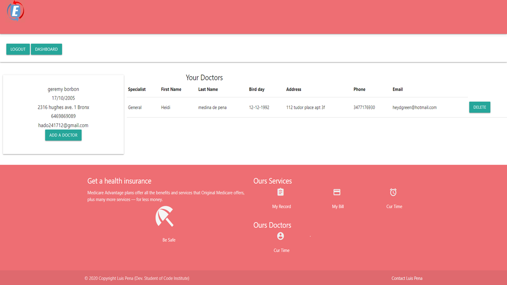

# Emergencylevel

[open in heroku](https://emergencylevel.herokuapp.com/):

emergency level is an application that seeks to manage the information of patients who enter the emergency room by generating a number of tickets to speed up the quality of care, the interns will be able to complete their information in liena or the nurse will be able to fill in the missing data.

the Director Doctor has access to delete, add and modify the information of the doctors.

This consists of a dashboard, where the user will have access to seven functions depending on their category, the Intern will only be able to do a search, see their information and select and / or see the main doctor.

The doctors, will be able to access Emergencyteam, here they will be able to attend to the patients who leave by registering in emergencylevel and they will be able to carry a report of the patient per day.

External API (smtp.gmail.com) This has an API that uses the email of the app and sends the user a link to complete the user information and password.

this application is made with the programming languages ​​HTML, CSS, JavaScript, Python + Flask and the design is based on materialcss, and it has a Json format database in mongodb and hosted in heroku

## The Director Doctor you can test
# Demo Director Doctor
- UserName: Jansgreen
- Password: L123456789
    * Only the ManagerDoctor can add and delate other Doctor and Nurse.

# Demo Doctor
- Username: XelohimGreen
- Password: L123456789
# Demo Nurse (all nurse can be add by Director Doctro)
- Username: xewisgreen
- Password: X123456789
# Demo Patient
- you can create the patient

##  The CRUD Operations Work

* The [Mongodb](https://cloud.mongodb.com/v2/): we are usin the Mongo database Atlas, we are using the Mongo database system, to store user data; where it can create, update, read, delete, at will.

## how do we apply this?
The regular patient in [MyDoctor](https://emergencylevel.herokuapp.com/MyDoctor): The User can add the doctor he wants, he can read the information about the doctors that he has in his profile, he can eliminate any doctor from his list.

Then when the user creates, the user creates her account in our application and also when she creates a ticket for the waiting shift in the emergency room.

Only with these conditions we have complied with The CRUD Operations Work.

- [C](https://): The in the tab I'm patient; the patient can Create a database, in the option Register, it is a form with the patient data and afther it will print a Tickets.

- [R](https://): In the Options My Doctor/Add a Doctor, the patient can choose and read informations about doctor and nurse.

- [U](https://): In this area the patient can READ and UPDATE from mongodb, when the user clic in ADD THIS DOCTOR.
it is posible in MyDoctor option, clic in Add a Doctor and select a Doctor options and clic CHOOSE; for other options the patient can only read.

- [D](https://): In MyDoctor the patient can READ and DELETE the doctor.

## Library used
 * Flask 1.1.2: flask a library especially for small applications like this, although this app seems to be powerful. the flask library allows us to use Jinja2==2.11.2 to have data communication enter the server with python and html.

 * Flask-WTF 0.14.3: allows us to have a better handling of the forms and a better visualization of it.

 * Pymongo 3.11.1: Is a Python library to connect to a MongoDB database.
 
 * bcrypt 3.2.0: Is a library that allows you to encrypt sensitive data so that it cannot be interpreted by a third party

 * Gunicorn: Is to serve all the dynamics of a project on a server. and in this application we use it for Heroku.

 * python-decouple: like the os library, this allows us to extract data from a external file in our environment, we apply it to sensitive information.

## Lenguage Used
- HTML
- Javascripts
- Cascading Style Sheets -CSS
- Python 3.7.7

## Template base
- Materialize. Availible at [github](https://github.com/Dogfalo/materialize):

## materialcss
https://materializecss.com/
Materialize. Availible at https://github.com/Dogfalo/materialize
Flask-Materialize. Available at https://bitbucket.org/cyberspy/flask_materialize

## Youtube
https://www.youtube.com/watch?v=3ZS7LEH_XBg
https://www.youtube.com/watch?v=4o7C4JMGLe4&t=374s
https://www.youtube.com/watch?v=iIhAfX4iek0&t=239s
